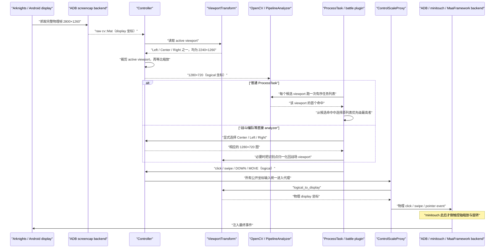

# MAA 非 16:9 真机适配：架构与改动账本

## 范围与基线

- 上游：MaaAssistantArknights `v6.14.2`
- 基线提交：`2b44185c615d81bc39454933cd4649536c23f4f3`
- 验证设备：Android 真机，物理 display `2800×1260`
- MAA 逻辑图像：固定 `1280×720`
- 当前推荐模式：`InstanceOptionKey::Viewport = 7`，值为 `adaptive`
- 可复现来源：`patches/v6.14.2-viewport-transform.patch`

本改动不改变 Android 的显示分辨率，也不改变游戏渲染分辨率。它只在 MaaCore
内部决定“从原始截图的哪块区域生成 `1280×720` 识别图”，并把识别所得逻辑坐标
反向映射到原物理 display。

## 完整坐标链路



### 三个坐标空间

| 空间 | 示例尺寸 | 所有者 | 约束 |
|---|---:|---|---|
| physical display | `2800×1260` | 截图 backend、最终输入 backend | 原始截图必须按此尺寸保存，不能预先伪装成逻辑尺寸 |
| active viewport | `2240×1260` | `ViewportTransform` | 始终等比 16:9；adaptive 下 X 可为 `0`、`280`、`560` |
| MAA logical | `1280×720` | OpenCV、任务资源、业务插件 | 模板 ROI、识别矩形、任务 click/swipe 均在此空间 |

识别矩形本身不需要变成物理坐标。只有动作即将进入 controller 时才做一次
`logical → display`。反方向 `display → logical` 只用于诊断和跨 viewport 归一化。

## 分层改动

### 1. ViewportTransform：唯一几何真源

新增：

- `src/MaaCore/Controller/ViewportTransform.h`
- `src/MaaCore/Controller/ViewportTransform.cpp`

职责：

- `auto`：从 display 中选居中的最大 16:9 区域；`2800×1260` 得到
  `[280, 0, 2240, 1260]`。
- 自定义 Rect：接受 `[x,y,width,height]` 或同字段 JSON object。
- `hybrid`：中央内容保持 16:9，同时把逻辑图两侧各 400 px 替换为物理边缘；
  这是实验模式，不能解决所有页面锚点冲突。
- `adaptive`：提供 Left、Center、Right 三个同尺寸 viewport。
- `logical_to_display`、`display_to_logical`、swipe 变换和跨 viewport 点位换算。
- `preferred_alignment_for_logical_x`：为没有视觉证据的硬编码动作选择视口。

`highResolutionSwipeFix` 保持原语义：起点正常映射，终点使用“映射后的起点 +
未缩放的逻辑位移”。它不是普通等比 swipe。

### 2. Controller 与截图缓存

涉及：

- `Controller.cpp/.h`
- `ControlScaleProxy.cpp/.h`
- `Assistant.cpp`
- `Common/AsstTypes.h`

改动：

1. 新增 `InstanceOptionKey::Viewport = 7`，必须在 connect/attach 前设置。
2. `Controller::get_image()` 按真实 display size 建立 `m_cache_image`，避免把
   `2800×1260` 原始帧写进旧的逻辑尺寸容器。
3. `Controller::get_resized_image_cache()` 校验 active viewport 边界，先裁剪，
   再缩放到 `1280×720`。
4. hybrid 模式在缩放后拼回物理左右边缘带。
5. Controller 暴露 adaptive 状态、当前 alignment、alignment 切换和点位换算。
6. `ResolutionInfo` 回调增加 display、viewport 和 logical 尺寸，便于运行留证。

支持的 viewport 值：

```text
auto
hybrid
adaptive
[280,0,2240,1260]
{"x":280,"y":0,"width":2240,"height":1260}
```

设备旋转后必须重新连接，使 transform 按新 display 尺寸重建。

### 3. 输入统一入口

所有任务侧入口现在是：

```text
Controller::click/swipe/inject_input_event
  -> ControlScaleProxy
  -> ViewportTransform
  -> ControllerAPI backend
```

修复前，`Controller::inject_input_event()` 直接调用 `m_controller`，因此多指
`TOUCH_DOWN`/`TOUCH_MOVE` 绕过缩放。修复后：

- `TOUCH_DOWN`、`TOUCH_MOVE`：从 logical 映射到 display。
- `TOUCH_UP`：没有点坐标，原样透传。
- key down/up、wait、reset、commit：没有画面坐标，原样透传。

`AdbController`、`MinitouchController`、`MaaFwAdbController`、
`MaaFwAndroidNativeController`、`Win32Controller` 的
`inject_input_event()` 是物理 backend 实现。它们看起来“没有经过
ControlScaleProxy”，但其输入已经在上层变换；任务或插件不得直接持有并调用这些
backend。当前活动源码中，任务侧没有直接 backend 多点触控调用；回收算法里只有一段
注释掉的 `ctrler()->inject_input_event` 示例。

这一不变量由 `tools/maa-iteration.py source-audit` 检查。

### 4. 通用 adaptive 识别

`ProcessTask::find_first()` 的规则是：

1. 抓一次完整物理帧。
2. 从同一帧生成当前、Center、Left、Right 候选逻辑图，不重复 ADB screencap。
3. 每个候选图只运行一次完整的有序任务列表。
4. `PipelineAnalyzer` 会返回该图中列表顺序最靠前的命中；再从三个候选首命中中
   选择原任务列表优先级最高者。
5. 保存命中 alignment，后续动作使用相同 viewport。

第 4 步与“逐任务 × 逐视口”语义等价：若某个更高优先级任务能在任意视口命中，
包含它的视口不可能先返回一个更低优先级任务；因此所有视口首命中的最小列表下标，
就是全局首命中。识别次数由 `任务数 × 3` 降为最多 `3`。

不能改成“比较三个视口的最高模板分数”。分数只在同一任务的匹配中有意义，不能让
低优先级任务凭高分越过状态机优先级。

`JustReturn` 没有截图和匹配矩形。对 ClickRect、ClickSelf 和 Swipe，代码用动作
中心 X 推断 Left/Center/Right，避免继承上一页面的 alignment。

### 5. 战斗、编队与技能插件

这些路径直接构造 analyzer，不经过通用 `ProcessTask::find_first()`，因此单独处理：

- `RoguelikeBattleTaskPlugin`：每轮战场识别前固定 Center。
- `BattleHelper::update_deployment`：战场/地图为 Center；右侧部署栏临时用 Right，
  识别矩形换算回战场逻辑坐标后再点击。
- 干员详情姓名 OCR：面板在物理左边缘，临时用 Left。
- 头像重匹配：部署栏在物理右边缘，临时用 Right，结果归一化。
- 暂停、加速、取消选择：允许通用识别选择 Right，执行后恢复原战场 alignment。
- `RoguelikeFormationTaskPlugin` 与 `RoguelikeSkillSelectionTaskPlugin`：初次失败时
  遍历三个 viewport；父 ProcessTask 仍需点击按钮时恢复父级 alignment。

当前结算统计 analyzer 仍未 adaptive 化，记录为 `MAA-OCR-001`。

### 6. 仓库、干员箱与其它功能探针

`DepotRecognitionTask` 和 `OperBoxRecognitionTask` 都直接用 `ctrler()->get_image()` 构造
analyzer，不完全依赖 `ProcessTask::find_first()` 的 adaptive 遍历。真机验证新增了两条
约束：

- 仓库“全部”页签锚定物理右边缘，切换后的基础物品从物理左边缘排列。因此
  `analyze_basic_items()` 必须先用 Right 匹配并点击页签，再用 Left 取图识别物品，最后
  恢复进入函数前的 alignment。
- 仓库普通材料和基础物品使用不同的颜色预筛阈值；基础物品为 500，普通材料仍为
  400，避免为适配龙门币而全局放宽。
- `OperBoxInfo` 的正式字段名是 `all_opers` 和 `own_opers`。runner 只把它们汇总为数量，
  原始干员信息只留在本机 run directory。

通用功能 runner 只允许 `StartUp`、`Depot`、`OperBox` 和 `Award`。前三者按只读探针
执行；`Award` 会改变账号状态，必须显式传 `--allow-account-mutation`，其默认参数也只
开启日常/周常任务奖励，邮件、招募、合成玉、采矿和特别登录领取全部关闭。战斗、招募、
基建和商店不会因为“只是测试”而自动获得执行权限。

### 7. 界园资源状态机

`resource/tasks/Roguelike/JieGarden.json` 的真机修正：

- 覆盖 `Begin.next`：`Continue` 前置，`ExitThenAbandon` 固定为最后兜底。
- `Continue.next` 重新接回 `Begin` 通用识别链。
- `ClickToDrops` 补齐教程、奖励、招募、商店、地图和自循环出口。
- `ClickToStartPoint` 使用更可靠的固定 Rect。
- 新增通宝教程关闭、招募放弃确认等页面节点。
- 扩大通宝确认按钮 ROI。
- `DropsFlag_default` 在普通 `Stages` 前尝试 `StrategyChange`。
- `StageTrader.templThreshold = 0.68`，覆盖真机 `0.692–0.696` 分数。

危险兜底没有从上游资源中永久删除，因为某些显式重置流程确实需要它。诊断 runner
会在运行时加载一个最后覆盖的资源 overlay，把 `Roguelike@ExitThenAbandon.action`
改为 `Stop`；这比在 callback 后抢先调用 stop 更可靠，因为 ProcessTask 的
`SubTaskStart` 回调和真实 click 之间存在竞争窗口。

### 8. API、GUI 与测试

- `Assistant::set_instance_option` 接受 Viewport。
- WPF `InstanceOptionKey` enum 同步为 7；当前没有新增 GUI 输入框，调用方需在
  connect 前通过 API 设置。
- 新增独立 `maa-viewport-transform-test`，覆盖 identity、普通 16:9、超宽屏、
  自定义 Rect、hybrid、adaptive、跨 viewport 点位、swipe、边缘动作和非法边界。
- `tools/build-maa-viewport.ps1` 应用补丁、跑 viewport 单测并构建 MaaCore。
- `tools/maa-iteration.py source-audit` 对输入入口、截图裁剪、adaptive 复杂度和
  关键 JieGarden 状态机不变量做静态校验。

## Swipe 特殊语义清单

| 语义 | 文件/函数 | 坐标发生阶段 |
|---|---|---|
| Rect swipe 在两个 Rect 内随机取点；`1×1` Rect 视为精确点 | `ControlScaleProxy::swipe(Rect, Rect)` | logical |
| ADB 非精确 Rect swipe 的 X 距离乘 `adb_swipe_x_distance_multiplier` | 同上 | logical，viewport 映射前 |
| `highResolutionSwipeFix` 保持未缩放逻辑位移 | `ViewportTransform::logical_swipe_to_display` | logical → display |
| ADB 起点越界钳制，终点允许越界 | `AdbController::swipe` | display |
| ADB duration multiplier | `AdbController::swipe` | backend |
| ADB extra short swipe，用于终止偶发过冲 | `AdbController::swipe` | display |
| minitouch 贝塞尔/插值 slope、默认 duration | `MinitouchController::swipe`、`SwipeHelper.hpp` | display/touch axis |
| swipe-with-pause 距离阈值，触发 Esc 或 maatouch key | `MinitouchController::swipe` | display/touch axis |
| minitouch extra swipe 与 extra end delay | `MinitouchController::swipe` | touch axis |
| MaaFramework Android native 的插值、pause/extra swipe | `MaaFwAndroidNativeController::swipe` | display/backend |
| Win32 control unit 的插值、pause/extra swipe | `Win32Controller::swipe` | window/display |
| 部署拖拽按距离计算 duration，支持暂停部署 | `BattleHelper::deploy_oper` | logical |
| 部署朝向第二段 swipe，含边界修正与逻辑距离系数 | `BattleHelper::deploy_oper`、`fix_swipe_out_of_limit` | logical |
| 资源动作 `specialParams`：duration、extra、slopeIn、slopeOut | `ProcessTask::exec_swipe_task` | logical |
| 招募、肉鸽道具、基建、仓库等业务慢滑/翻页 | 各 Task plugin 调用 `Controller::swipe` | logical，最终仍统一过 proxy |

最重要的不变量是：业务层只定义 logical swipe 语义；viewport 只负责几何变换；
backend 才负责设备特有的 duration、插值、暂停和 extra swipe。

## 当前边界

- adaptive 解决的是几何与页面锚点，不保证所有 OCR ROI 和业务策略正确。
- 三个 viewport 都来自同一物理截图，所以不会产生跨帧点击；插件主动再次
  `get_image()` 时仍可能遇到页面动画。
- exact PNG 静态画面 watchdog 只能发现字节完全一致的卡死；动态背景上的逻辑卡死
  主要依靠 callback loop 和 no-progress watchdog。
- 战斗失败与坐标正确性必须分开评估。已验证部署、暂停和 2× 位置正确，不等于
  当前阵容一定能通关。
