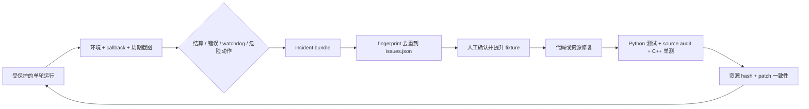

# MAA 适配持续迭代手册

目标不是让长跑“尽量继续”，而是让每个新页面或失败都能安全停住、留下足够证据、
去重归档、变成回归样本，并在修复后通过同一套门禁。

## 闭环



每次修复的最小交付单元是：

```text
问题 ID + 原始证据 + 稳定 fingerprint + 修复 + 回归 + 补丁同步
```

只有现场改 JSON 或调阈值、没有 fixture/测试/问题 ID，不算闭环。

## 跨项目验收契约

MAA 是当前唯一端到端跑通的参考实现。崩铁、终末地或后续新项目不能因为“适配器已
接入”就继承可运行状态，必须逐项复用并证明以下链路：

1. 物理 display、active viewport、logical 坐标空间分离。
2. click、swipe、DOWN、MOVE 等所有带坐标输入经过同一个反向映射入口。
3. 绕过通用识别器的直接 analyzer 逐页面声明 alignment 并有 fixture 回归。
4. 破坏性兜底在执行前被资源或策略层拦截，而不是只靠 callback 后抢停。
5. 完整真机任务到达自然终点，运行 manifest、callback、截图和 incident 可追溯。
6. 失败能进入问题账本，并提升为可重复回归；源码、资源和交付补丁无漂移。

目录执行门采用 fail-closed：只有适配器快照显式返回
`end_to_end_verified=true` 才允许预检和启动；字段缺失等同未验收。这个布尔值只能在
上述证据齐备后修改，不能用单个页面 smoke、能连接 ADB 或能启动外部进程替代。

## 1. 运行前门禁

### 校验账本、fixture 和护栏策略

```powershell
$env:PYTHONPATH = "src"
python tools/maa-iteration.py validate
```

### 校验 MAA 工作树架构不变量

```powershell
python tools/maa-iteration.py source-audit `
  --source-root .codex-research/MAA-v6.14.2-git
```

它会检查：

- `Controller::inject_input_event` 仍经过 `ControlScaleProxy`。
- DOWN/MOVE 仍做 logical → display。
- 截图仍先裁 active viewport。
- adaptive 识别仍最多每 viewport 一次，而不是恢复成任务数乘视口数。
- 战斗仍显式区分 Center/Left/Right。
- Continue、ExitThenAbandon 顺序、StageTrader 阈值和 StrategyChange 路由未漂移。

### 校验源码资源与实际 runtime

```powershell
python tools/maa-iteration.py resource-check `
  --source-root .codex-research/MAA-v6.14.2-git `
  --runtime-root C:\apps\MAA-v6.14.2-win-x64
```

返回码 2 表示 hash 不一致。此命令只读，不会擅自覆盖下载目录。确认 diff 后再人工同步
资源，并重新执行校验。

### 校验可复现补丁

```powershell
python tools/maa-iteration.py patch-check `
  --source-root .codex-research/MAA-v6.14.2-git
```

工作树与补丁不同步时必须先审查 diff。确认当前 MAA HEAD 仍是基线提交后，显式同步：

```powershell
python tools/maa-iteration.py patch-sync `
  --source-root .codex-research/MAA-v6.14.2-git
```

`patch-sync` 会拒绝非
`2b44185c615d81bc39454933cd4649536c23f4f3` 的 HEAD，也拒绝用空 diff 覆盖补丁。

## 2. 构建与离线测试

```powershell
$env:PYTHONPATH = "src"
python -m unittest tests.test_maa_iteration -v

./tools/build-maa-viewport.ps1 `
  -MaaSource .codex-research/MAA-v6.14.2-git `
  -SkipPatch
```

`-SkipPatch` 用于当前已经有改动的研究工作树。要验证真正可复现性，应另外准备一个
干净 v6.14.2 工作树，不带 `-SkipPatch` 构建；脚本会从已登记补丁恢复所有改动。

## 3. 安全执行一轮

以下命令才是正式 runner；不要再使用 `.codex-research/maa-roguelike-run.py`：

```powershell
python tools/maa-roguelike-run.py `
  --core-root .codex-research/MAA-v6.14.2-git/build-viewport/bin `
  --runtime-root C:\apps\MAA-v6.14.2-win-x64 `
  --maa-source-root .codex-research/MAA-v6.14.2-git `
  --adb C:\Android\platform-tools\adb.exe `
  --address DEVICE_SERIAL `
  --viewport adaptive `
  --run-dir .codex-research/roguelike-safe-001
```

默认行为：

- `RoguelikeSettlement` 一出现就主动 stop，成功/失败结算都算完整一轮。
- `ExitThenAbandon` 在资源加载层被改成 `Stop`，不会等 Python callback 再抢停。
- 每 30 秒心跳和缓存截图。
- 同一任务连续开始 12 次、连续 5 张完全相同截图、240 秒无语义进展会生成 incident
  并停机。
- 截图超过 2.5 秒会生成性能 incident，但默认不单独停机。
- 最长 3 小时；timeout 会留证并返回非零。

只有明确要清理一轮已知探索时，才允许显式加：

```text
--allow-destructive-actions
```

这个 flag 是权限边界，不应写进默认脚本。`--continue-after-settlement` 同样只用于专门的
多轮耐久实验，不能用于“一轮”验收。

### 其它功能探针

首页、仓库和干员箱使用通用功能 runner。它与肉鸽 runner 分开，避免把单任务成功误作
一轮结算，也避免无意间开放会消耗账号资源的任务：

```powershell
python tools/maa-feature-run.py `
  --core-root .codex-research/MAA-v6.14.2-git/build-viewport/bin `
  --runtime-root C:\apps\MAA-v6.14.2-win-x64 `
  --adb C:\Android\platform-tools\adb.exe `
  --address DEVICE_SERIAL `
  --viewport adaptive `
  --task Depot `
  --run-dir .codex-research/maa-features/depot-001
```

白名单和权限边界：

| 任务 | 默认风险 | 约束 |
|---|---|---|
| `StartUp` | read-only | 默认不主动启动游戏进程 |
| `Depot` | read-only | 只导航、滑动和识别，不写入物资 |
| `OperBox` | read-only | 只导航、滑动和识别；原始干员数据留在本机 |
| `Award` | account mutation | 必须传 `--allow-account-mutation`；默认仅日常/周常任务奖励 |

`Fight`、`Recruit`、`Infrast`、`Mall` 会消耗或改变账号资源，runner 会直接拒绝。若以后
需要验证，必须先为具体参数定义风险等级、停止条件和证据边界，不能直接扩大白名单。
每个探针目录保存 `request.json`、`environment.json`、`events.jsonl`、`initial.png`、
`final.png` 和 `result.json`；这些文件可能含账号信息，默认不得提升为 fixture 或提交。

## 4. 运行产物

```text
run-dir/
|-- request.json                  # 完整参数和终点/护栏语义
|-- environment.json              # core/adb/resource/policy hash、设备信息、源码状态
|-- guard-overlay/
|   |-- guard-policy.json
|   `-- resource/tasks/mobile_profiler_guard.json
|-- events.jsonl                  # 原始 MaaCore callbacks
|-- status.json                   # 当前或最终状态
|-- result.json                   # 终点分类、game_pass、截图统计、incident 摘要
|-- snapshot-*.png
|-- settlement.png / terminal.png
|-- final.png
|-- user/debug/asst.log
`-- incidents/
    |-- index.json
    `-- maa-<kind>-<fingerprint>/
        |-- incident.json         # occurrence_count，按 fingerprint 去重
        |-- environment.json
        |-- occurrence-*.png
        |-- occurrence-*-events.jsonl
        `-- occurrence-*-asst.log.txt
```

终点字段必须这样解释：

| 字段 | 含义 |
|---|---|
| `one_round_completed` | 收到自然结算回调；不等于通关 |
| `game_pass` | 游戏是否通关；失败结算为 `false` |
| `maa_all_tasks_completed` | 调度队列结束；不能替代自然结算 |
| `exit_reason` | pass/fail settlement、guard、watchdog、timeout、manual 等精确原因 |
| `successful` | 本次“一轮自然闭环”验收成功；自然失败也可以为 true，同时 `game_pass=false` |

## 5. Triage：把 incident 去重进问题账本

先人工查看 incident 的截图、前后 callbacks 和日志尾部，确认不是隐私页面。然后运行：

```powershell
python tools/maa-iteration.py triage `
  --run-dir .codex-research/roguelike-safe-001
```

相同 fingerprint 不会重复创建 issue；同一 run 重复 triage 也不会重复累计 occurrence。
新问题默认进入 `open`，需要人工补齐 area、root cause、fix 和 regression。

Fingerprint 只使用稳定字段，例如问题类型、任务名、前序任务、终点类型或静态画面 hash；
不会把时间戳、匹配分数、矩形等易变值混进去。

## 6. 将现场截图提升为 fixture

只有人工确认可以进入版本库的截图才执行：

```powershell
python tools/maa-iteration.py promote-fixture `
  --incident .codex-research/roguelike-safe-001/incidents/INCIDENT/incident.json `
  --id jiegarden-strategy-change-001 `
  --page strategy-change `
  --expected-task JieGarden@Roguelike@StrategyChange `
  --alignment right `
  --must-not-match JieGarden@Roguelike@DropsFlag
```

命令会复制最新 incident screenshot 到 `fixtures/images/`、记录 SHA256，并向 manifest
写入：

- 页面名。
- 期望 task。
- 期望 alignment。
- 禁止误命中的 task。
- 来源 incident fingerprint。

fixture manifest 是离线 OpenCV 回归的契约。当前仓库不自动收录现场图片，是为了避免
把账号或通知内容未经确认带入版本库。

## 7. 修复规则

### 模板/阈值问题

必须同时准备：

- 正样本：期望任务和 alignment。
- 至少一个视觉相似负样本：写入 `must_not_match`。
- 修复前失败、修复后通过的离线结果。

不能只因一张现场图把阈值持续下调。

### 状态机问题

优先修正任务顺序和页面路由，而不是直接降低所有模板阈值。新增节点要检查：

- `next`、`onErrorNext`、`exceededNext`。
- 是否最终走向危险兜底。
- Continue/恢复路径。
- 新任务是否在正常地图或奖励页产生误命中。

### Viewport 问题

每个修复必须明确：

- 识别使用哪个 alignment。
- 动作继承哪个 alignment。
- 若识别和动作不在同一 viewport，在哪里做点位归一化。
- analyzer 是否绕过 `ProcessTask`。

### 性能问题

性能改动不得改变任务优先级。对比至少保留：

- 相同资源 hash。
- 相同页面/fixture 序列。
- 截图 p50/p95/max。
- 识别调用次数或耗时。
- callback task 序列。
- 最终命中 task/alignment。

## 8. 关闭问题的门禁

问题从 `open/mitigated` 改为 `fixed` 前，必须满足：

1. `issues.json` 有 root cause、修复文件和 regression。
2. 有可复现 fixture 或纯逻辑单测；无法公开的现场证据要说明原因。
3. Python 测试通过。
4. `source-audit` 通过。
5. viewport C++ 单测和 MaaCore 构建通过。
6. resource-check 通过。
7. patch-check 通过。
8. 高风险改动至少完成一次受保护的真机单轮；不能为了验证而放行危险兜底。

这套机制把“发现问题及时改进”具体化为可执行门禁：运行自动留证，triage 自动去重，
人工只负责判断页面语义和可公开性，修复必须带回归和补丁一致性。
