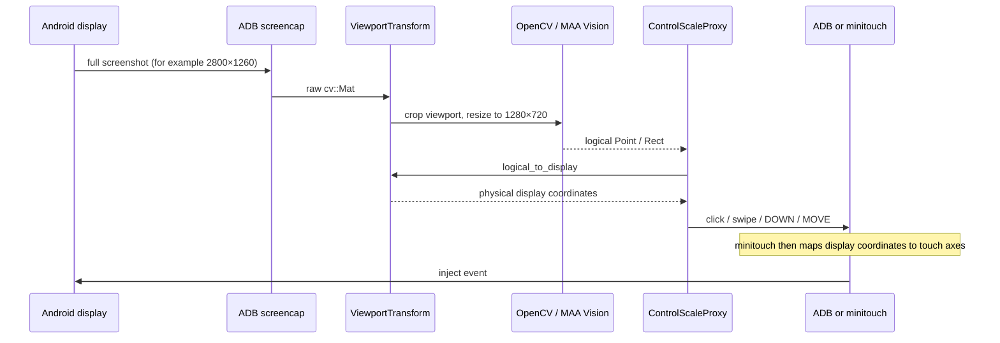

# MAA v6.14.2 非 16:9 真机适配实验

本目录保存针对
[`MaaAssistantArknights v6.14.2`](https://github.com/MaaAssistantArknights/MaaAssistantArknights/releases/tag/v6.14.2)
的可复现补丁和验证方法。补丁基于上游 AGPL-3.0 源码并按相同许可条款提供；
本目录不复制完整源码树、资源或构建产物。使用或分发前请阅读
[上游许可证](https://github.com/MaaAssistantArknights/MaaAssistantArknights/blob/v6.14.2/LICENSE)。

维护文档：

- [`ARCHITECTURE.md`](ARCHITECTURE.md)：完整坐标链路、分层改动、绕过点审计与 swipe 语义。
- [`KNOWN-ISSUES.md`](KNOWN-ISSUES.md)：历次真机问题、状态和开放项。
- [`ITERATION-RUNBOOK.md`](ITERATION-RUNBOOK.md)：安全长跑、incident、triage、fixture 和交付门禁。
- [`issues.json`](issues.json)：机器可读问题真源。

## 当前结论

补丁已经在 `2800×1260` 的 Android 真机上完成以下闭环：

1. MAA Core 不再因为设备整体分辨率不是 16:9 而拒绝连接。
2. 默认从物理屏幕中央选取最大的 16:9 viewport；该设备自动得到
   `[280, 0, 2240, 1260]`。
3. ADB 原始截图先按 viewport 裁切，再统一缩放为 OpenCV 使用的
   `1280×720` 逻辑图像。
4. click、Point/Rect swipe 和多点触控事件中的 DOWN/MOVE 使用同一个
   `logical → display` 变换。
5. 真机连接、截图和一次无资源消耗的登录页点击均成功；返回截图为
   `1280×720`。

实现仍保留 MAA 原有 swipe 语义：Rect 随机点、ADB 的 X 距离修正、
`highResolutionSwipeFix` 的“不缩放逻辑位移”、extra swipe、pause threshold，
以及 minitouch 在 display 坐标之后执行的触控轴缩放和旋转。

## 界园肉鸽真机长跑（2026-07-27）

在同一台 `2800×1260` 真机上，一次持久化探索跨 runner 重启续跑到了游戏内
自然结算。已实际经过招募、自动部署与作战、战后奖励、通宝教程与拾取、事件
选项、商店投资和购买、思维边界特殊路由等链路。商店成功投资 6 次；“是非境”
中已识别并点击 `拾遗`、`传说`、`易与` 等节点。第三战“有教无类”自动部署
4 名干员后失败，游戏结算回调为 `game_pass: false`，因此本次验证证明的是
“一轮探索能够自然结束”，不是成功通关。

长跑期间补充了以下界园资源状态机修正：

1. `Begin` 优先处理现存探索的 `Continue`，将 `ExitThenAbandon` 降为末尾兜底。
2. `Continue` 点击后重新接入通用 `Begin` 识别链，允许恢复到楼层页或地图。
3. `StageTrader` 的 HSV 匹配阈值从默认约 `0.70` 调至 `0.68`；真机实测分数
   稳定在 `0.692–0.696`。
4. `DropsFlag` 在奖励任务之后、普通地图路由之前尝试 `StrategyChange`，避免
   “是非境”底栏图标以 `0.979` 的分数误命中奖励标记后耗尽重试。
5. 补充招募放弃确认、通宝教程出口和通宝确认按钮 ROI，覆盖本次实际遇到的
   新页面。

当前边界与后续问题：

- 正式 runner 已监听 `RoguelikeSettlement` 并主动停止，不再只依赖任务完成事件；
  `.codex-research/maa-roguelike-run.py` 仅是历史临时脚本，不应继续使用。
- 结算页本身能够识别并确认，但 `Floor`、`Step`、`Combat`、`Recruit`、
  `Collection`、`BOSS`、`Score`、`Exp`、`Skill` 等统计 OCR 在该真机布局上仍
  失败，需要让结算分析器也使用页面合适的 adaptive alignment。
- `ExitThenAbandon` 在上游任务图中仍是多个错误分支的破坏性兜底；正式 runner
  默认用资源 overlay 把它变成 `Stop`，先保存 incident，只有显式
  `--allow-destructive-actions` 才会放行。
- 本轮最终败因是关卡策略/阵容强度导致漏怪，不是点击坐标漂移；截图中部署、
  2 倍速和暂停等输入均落在正确位置。

## 其它功能真机验证（2026-07-27）

同一台非 16:9 真机和同一份 adaptive 构建还完成了以下任务链：

| 任务 | 结果 | 用时 | 覆盖点 |
|---|---|---:|---|
| `StartUp` | 成功 | 6.2 秒 | 连接与首页启动链 |
| `Depot` | 成功 | 35.8 秒 | 长列表滑动、左右边缘页签/内容、基础物品识别 |
| `OperBox` | 成功 | 209.0 秒 | 长列表分页和直接 analyzer |
| `Award` | 成功 | 25.3 秒 | 日常/周常页面；其它领奖项均关闭 |

`tools/maa-feature-run.py` 会保存请求、环境、callbacks、前后截图和去敏汇总。默认只允许
受控功能；`Award` 必须显式确认账号变更。`Fight`、`Recruit`、`Infrast`、`Mall` 不在
探针白名单中，因为它们可能消耗理智/招募资源、改变基建排班或购物。

三个 `tools/maa-*.py` 文件现在只是兼容命令入口；正式实现和默认危险动作策略随
`mobile_profiler` Python 包分发。UI、wheel 和便携版不再依赖仓库根目录仍然存在，
并用回归测试保证包内策略与本目录的审计源一致。

仓库运行额外暴露出页面内部也可能跨 viewport：右侧“全部”页签和左侧基础物品不能由
一个固定 crop 同时覆盖。因此直接 analyzer 也必须显式声明截图 alignment，而不能只依赖
通用 `ProcessTask` adaptive。

## “开源自动化”页面接入

Mobile Profiler 的“开源自动化”页面现将 MaaAssistantArknights 作为默认项目，也是当前
唯一标记为端到端真机验收通过的项目。运行面板提供：

- `StartUp`、`Depot`、`OperBox`、`Award` 与受保护的 `Roguelike` 任务选择。
- adaptive MaaCore 目录、官方资源目录和 10 分钟/30 分钟/3 小时停止上限。
- 启动前通过 patched MaaCore 完成连接、截图和 `ResolutionInfo` 预检。
- `Award` 单次账号变更确认；该确认不落盘，并在进程结束时自动清除。
- 界园肉鸽固定使用资源层危险退出护栏，页面不会提供放行 destructive fallback 的选项。

页面适配器本身也已在同一真机实跑：预检确认 display `2800×1260`、logical
`1280×720` 和 viewport `[280,0,2240,1260]`，随后 StartUp 任务链在 8.2 秒内完成。
首次接入测试发现的熄屏/重复启动问题已登记为 `MAA-UI-001` 并加入回归。

崩铁和终末地项目仍保留在目录中供后续重构，但明确显示为“端到端未验收”，前端和
服务端都拒绝启动。它们只有在复用本项目的坐标分层、统一输入代理、直接 analyzer 审计、
危险动作前置护栏以及 incident→fixture→回归闭环并完成真机全流程后，才能解除门禁。

## 坐标链路



`Controller::inject_input_event()` 也改为经过 `ControlScaleProxy`；UP、key、wait、
reset 和 commit 不携带坐标，继续原样下传。

## viewport 选择

基础默认值是 `auto`。它选择居中的最大 16:9 区域，适合只使用中央安全区的页面。
完整肉鸽链路推荐 `adaptive`，因为它会在 Left/Center/Right 三个等比视口间选择并让
识别与动作保持同一 alignment。补丁还新增实例选项
`InstanceOptionKey::Viewport = 7`，必须在连接前设置，接受：

```text
auto
hybrid
adaptive
[x, y, width, height]
{"x": 280, "y": 0, "width": 2240, "height": 1260}
```

例如，将 `2800×1260` 整屏强制压到逻辑空间可设为
`[0,0,2800,1260]`。这能保留两侧 UI，但会横向压缩模板，通常只适合诊断；
优先方案仍是让游戏 UI 安全区落入中央 16:9 viewport。

加载页、实名/公告等游戏外层 UI 可能仍锚定在物理屏幕边缘，因此自动中央裁切
会截掉其中一部分。这不等于底层映射错误，而是需要游戏安全边距或页面级 viewport
策略。设备旋转后也需要重新连接，让 transform 按新分辨率重建。

## 构建

准备一个干净的 v6.14.2 Git 工作树，然后运行：

```powershell
./tools/build-maa-viewport.ps1 -MaaSource C:\src\MaaAssistantArknights
```

脚本会校验上游提交、初始化 `src/MaaUtils`、应用
[`v6.14.2-viewport-transform.patch`](patches/v6.14.2-viewport-transform.patch)、
下载官方 MaaDeps、运行 viewport 单测并构建 Release `MaaCore.dll`。它不会 reset
或覆盖一个未知版本/已有冲突改动的 MAA 工作树。

## 真机只读冒烟

构建后，可复用官方 MAA 发布目录中的资源进行连接和截图：

```powershell
python tools/maa-viewport-smoke.py `
  --core-root C:\src\MaaAssistantArknights\build-viewport\bin `
  --runtime-root C:\apps\MAA-v6.14.2-win-x64 `
  --adb C:\Android\platform-tools\adb.exe `
  --address DEVICE_SERIAL `
  --viewport auto `
  --output .\maa-viewport-smoke.png
```

默认不注入输入。需要明确验证单次逻辑坐标点击时，可以额外传入
`--click X Y --post-click-delay 2`。

## 受保护的单轮肉鸽

完整运行使用正式 runner。它默认启用 adaptive、结算终止、危险动作资源护栏、
callback/静态画面/no-progress watchdog，以及可去重的 incident bundle：

```powershell
python tools/maa-roguelike-run.py `
  --core-root C:\src\MaaAssistantArknights\build-viewport\bin `
  --runtime-root C:\apps\MAA-v6.14.2-win-x64 `
  --maa-source-root C:\src\MaaAssistantArknights `
  --adb C:\Android\platform-tools\adb.exe `
  --address DEVICE_SERIAL `
  --viewport adaptive `
  --run-dir .\maa-runs\jiegarden-001
```

详细产物、triage 和 fixture 流程见
[`ITERATION-RUNBOOK.md`](ITERATION-RUNBOOK.md)。
