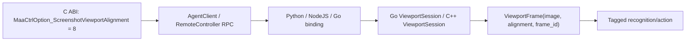
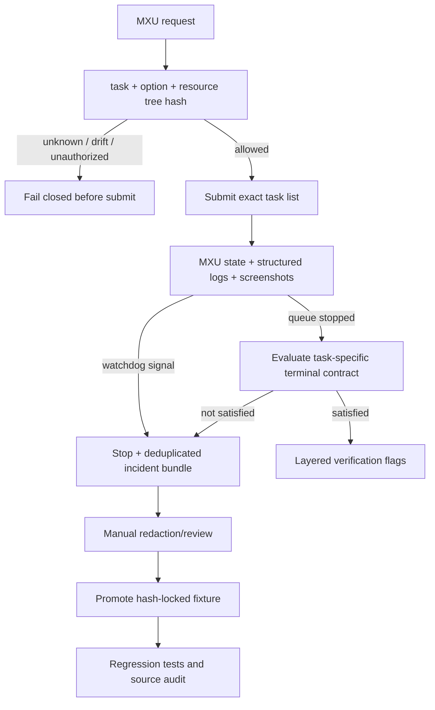

# MaaEnd 手机分辨率适配架构

## 截图、识别与输入链路

```mermaid
sequenceDiagram
    participant Device as "Android display / touch device"
    participant Capture as "MaaAdbControlUnit"
    participant Failover as "ScreencapAgent"
    participant Ctrl as "ControllerAgent"
    participant View as "ViewportTransform"
    participant Reco as "Pipeline / OpenCV / Agent ViewportSession"
    participant Queue as "Controller action queue"
    participant Input as "ADB / minitouch backend"

    Device->>Capture: "raw screenshot, e.g. 2800×1260"
    Capture->>Failover: "cv::Mat or backend failure"
    Failover->>Failover: "active first; eligible fallbacks; exponential backoff"
    Failover->>Ctrl: "new raw frame"
    Ctrl->>Ctrl: "cache raw; increment monotonic frame_id once"
    Reco->>Ctrl: "select Left / Center / Right"
    Ctrl->>View: "crop selected 16:9 viewport"
    View-->>Reco: "logical 1280×720 + alignment + frame_id"
    Reco-->>Queue: "hit/action coordinates + alignment + frame_id"
    Queue->>Queue: "snapshot alignment when action is enqueued"
    Queue->>View: "logical_to_display(point, snapshotted alignment)"
    View-->>Input: "physical display coordinates"
    Input->>Input: "optional display-to-touch-axis rotation/scaling"
    Input->>Device: "click / swipe / contact event"
```

三个空间互不混用：

| 空间 | 示例 | 所有者 | 用途 |
|---|---:|---|---|
| raw display | `2800×1260` | Android/ADB | 原始截图、最终 display 输入坐标 |
| viewport rect | Left=`[0,0,2240,1260]`、Center=`[280,0,2240,1260]`、Right=`[560,0,2240,1260]` | `ViewportTransform` | raw 上的 16:9 候选区域 |
| logical | `1280×720` | Pipeline/OpenCV/Agent | 模板、ROI、识别框和动作坐标 |

`MAA_SCREENSHOT_VIEWPORT=1280x720:adaptive` 只配置 Framework 内部的裁剪与坐标变换，
不调用 Android `wm size`，也不改变手机显示分辨率。同一 raw frame 切换 Left/Center/Right
只重绘 logical image，不增加 `frame_id`；只有取得新 raw screenshot 才单调递增。

## 公共 viewport 契约



- `MaaViewportAlignment` 数值固定为 Center=`0`、Left=`1`、Right=`2`。
- adaptive 未激活时仅 Center 合法；Left/Right、未知枚举、错误值类型或没有有效 raw frame
  都返回失败。
- `Controller.GetInfo().screenshot_viewport` 公开 alignment、cached alignment、frame ID、
  available alignments、raw/logical 尺寸和 viewport rect。
- Controller action callback 公开 logical param、alignment、frame ID、可用时的 display param。
- Framework `RecoResult` 和 Go node callback 的 `reco_details` 公开
  `viewport_alignment + frame_id`；Starting 阶段没有识别证据，因此该字段为 `nil`。
- 旧 option、旧 callback 字段与标准 16:9 Center 行为保持兼容。

## Pipeline 与自定义 Agent

Pipeline adaptive recognition 对同一 raw frame 的候选 viewport 依次识别。命中后把
alignment 和 frame ID 写入 `RecoResult`，并在 action 入队前选择同一 alignment。
`DirectHit` 没有识别框，因此按动作逻辑 X 中心选择 Left/Center/Right。

Go `ViewportSession` 将 `SetAlignment → CacheImage/PostAction` 成对串行化：

- 已知 ROI 按中心 X 选择 alignment；全局视觉显式 Center；
- 不确定识别可在同一 raw frame 上遍历 Left/Center/Right；
- `Frame` 始终包含 image、alignment、frame ID，strict action 拒绝陈旧 frame；
- 错误、取消和退出路径恢复 alignment，并释放 session 记录的活动触点。

现有直接调用已迁移，包括 CaptureUid、CreditShopping、AutoStockStaple、ItemTransfer、
MapTracker、AutoFight、PuzzleSolver、SeizeDeliveryJobs、TrialOfSwordmancy、WebEvent、
TaskerSink、`pkg/control` 和 AccountSwitch 相关路径。

C++ MapLocator/MapNavigator 经过对应 wrapper：

- 世界视觉模型默认 Center；
- 左侧虚拟摇杆固定 Left；
- 右侧相机、跳跃和冲刺固定 Right；
- 图像产生的点携带产生它的 frame/alignment，动作前校验 frame freshness。

source audit 扫描 Go/C++ Agent，拒绝 wrapper 白名单之外的 `CacheImage`、
`PostClick/Swipe/Touch*`、Controller 直接坐标调用和 `adb shell input`。

## 异步动作与多点触控

MaaFramework 没有 MAA Core 的 `ControlScaleProxy`。统一坐标入口是
`ControllerAgent::preproc_touch_point(point, alignment)`，但 alignment 不再从执行时全局
状态读取，而是随 action 入队快照保存。

| 动作 | alignment 语义 |
|---|---|
| Click / LongPress / Scroll | 使用该 action 的入队快照 |
| Swipe | begin 与所有分段 end 使用同一快照 |
| MultiSwipe | 每个入队 action 固定快照，所有 contact/segment 使用它 |
| TouchDown | 固定该 contact 的 alignment |
| TouchMove after Down | 忽略后来全局切换，沿用 contact alignment |
| hover TouchMove before Down | 使用该 Move action 自身快照 |
| TouchUp | 释放 contact 并清理固定 alignment；本身没有坐标 |

按键、文本、wait、commit、StartApp/StopApp 不携带屏幕坐标。底层
`MtouchHelper::screen_to_touch()` 仍负责 display 坐标到触控轴、旋转和设备范围的映射；
viewport 变换不能下沉到这里，否则 ADB shell 和多点触控会出现两套坐标尺度。

## 竖屏启动门禁

```mermaid
sequenceDiagram
    participant MXU as "MXU"
    participant Checker as "AspectRatioChecker"
    participant Ctrl as "Controller"
    participant Game as "Endfield"

    MXU->>Checker: "Tasker Starting: AndroidOpenGame"
    Checker->>Ctrl: "resolution + screenshot_viewport info"
    Ctrl-->>Checker: "raw portrait; configured=true; active=false"
    Checker->>Checker: "validate exact DirectHit/DoNothing → known StartApp → gate chain"
    Checker->>Game: "allow only validated StartApp"
    Game-->>Ctrl: "rotate to landscape"
    Checker->>Ctrl: "refresh and poll up to 20 seconds"
    Ctrl-->>Checker: "active=true; raw landscape; logical=1280×720"
    Checker-->>MXU: "continue only after viewport gate"
```

其它 entry、未知渠道/package、额外节点、坐标动作、身份漂移或超时均 `PostStop()`。
同一个 checker 同时注册 Tasker 和 Context sink；transition 按 task ID 隔离并受锁保护。

## Guard、自然终点和持续改进



MXU 进程或队列结束从不直接等于业务成功。Probe 和普通任务都有独立 terminal contract；
watchdog 检查无进展、节点循环、静态/慢截图、后端切换、终态缺失和触点泄漏。失败证据
默认留在本机，只有人工去敏确认后才可进入 fixture manifest。

## 截图后端故障转移

`ScreencapAgent` 保留全部初始化成功候选：

1. 测速成功候选按耗时排序；测速失败但初始化成功者放在末尾。
2. 每帧先试 active，再试当前帧 eligible 的候选。
3. 成功候选成为新的 active。
4. 连续失败按 `1/2/4/8/16/32` 帧退避。
5. app 启停或分辨率变化广播给所有候选并清空退避。

后端切换不会改变坐标空间；Controller 只有拿到新 raw frame 后才更新 resolution、
ViewportTransform 和 frame ID。
