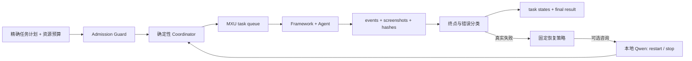

# 从 MAA 每日闭环迁移到 MaaEnd 的重构经验

## 证据边界

这些经验来自 MAA v6.14.2 在 `2800×1260` Android 真机上的 adaptive viewport
改造和 2026-07-28 每日队列闭环。该轮依次完成 `StartUp`、`Fight`、`Infrast`、
`Recruit`、`Mall`、`Award`，没有任务重试或恢复，暴露并修复了页面级 viewport、
预期负向探测、无人值守恢复和补丁漂移问题。

它们是 MaaEnd 的设计输入，不是 MaaEnd 的真机业务证据。MaaEnd 仍必须独立完成
`InWorld` 强启动终点、内部 Probe、受保护任务和完整组合验收；在此之前
`end_to_end_verified` 必须保持 `false`。

## 可迁移结论

| MAA 现场结论 | MaaEnd 对应落点 | 验收证据 |
|---|---|---|
| raw、viewport、logical 必须由一个几何真源管理 | Framework `ViewportTransform` | 同帧 Left/Center/Right、正反向坐标和边界单测 |
| 识别命中后不能在执行前丢失 viewport | `RecoResult`、action queue 固定 alignment + frame ID | callback 同时出现 logical/display 坐标、alignment 和 frame ID |
| 一个页面的页签、内容和按钮可能分布在不同 viewport | Go/C++ `ViewportSession` 和任务级 alignment 路由 | 页面级 fixture 覆盖 Left/Center/Right，结束时恢复调用前 alignment |
| adaptive 不能按跨任务模板分数选赢家 | 同一 raw frame 上保留节点优先级，只在候选 viewport 间复用截图 | 高优先级节点在任一 viewport 命中时不被低优先级节点抢占 |
| “没识别到”经常是条件探测，不等于业务失败 | 精确的 expected-negative 签名表 | `errors` 与 `optional_errors` 分离，单项、乱序和额外节点均有反例测试 |
| 调度队列结束不等于业务自然结束 | 每个 MaaEnd 任务独立 `terminal_contract` | MXU 终态、业务终点和终态截图同时满足 |
| callback 后抢停存在动作竞争窗口 | MXU 提交前 Guard、任务图 override 或 Agent 内 fail-closed | 未授权动作从未进入 Framework action queue |
| LLM 不适合进入点击热路径 | 可选本地模型只参与失败后的 `restart/stop` 决策 | 超时、非法输出和不可用均走固定本地策略 |
| 能在源码树运行不等于交付可复现 | 三个固定 HEAD、资源哈希、patch-sync/patch-check 和产物哈希 | 干净工作树可重建，运行 runtime 与审计资源完全一致 |

## 推荐的无人值守分层



各层职责不能互相渗透：

1. Admission Guard 只做权限、版本、资源哈希、设备身份和任务前置条件判断。
2. Coordinator 只按已批准计划执行、计时、留证和调用确定性恢复，不理解视觉页面。
3. Framework/Agent 负责识别与动作，所有坐标动作都携带产生证据的 alignment/frame ID。
4. Classifier 解释事件是否满足任务终点，保留原始事件，不改写执行历史。
5. 本地模型只读取失败摘要和最后截图，输出严格枚举；它不能调用 MXU、ADB、点击接口，
   也不能增加账号变更权限。

本地模型建议使用短超时、`temperature=0` 和结构化 JSON。若超时、断线或输出不是
`restart/stop`，由任务的幂等策略选择固定默认值，而不是继续等待模型。模型调用不得
占用截图/动作热路径，也不能成为成功判定的一部分。

## 事件与错误分类

MAA 的一次关键修复是保留 callback 的 `first`、`pre_task` 和单一 `probe`，随后把
预期负向探测放入 `optional_errors`。MaaEnd 不应复制这些字段名，但应保留同等语义：

```text
task_id, task_name, attempt, phase, event_kind,
node/entry, previous_node, candidate_nodes,
alignment, frame_id, action_id, terminal_contract
```

分类签名必须精确到任务、事件类型、候选节点序列和前置节点。例如：

```text
(task_name, event_kind, tuple(candidate_nodes), previous_node)
```

只有完整签名命中登记表才属于 expected-negative。禁止以下泛化：

- 把所有 recognition miss、ProcessTask/CustomRecognition 错误都设为 optional；
- 只因候选序列中包含某个常见节点就忽略整条错误；
- 只看 MXU 的 `succeeded/stopped` 而不检查业务终点；
- 在摘要中丢掉原始候选顺序、前置节点、alignment 或 frame ID。

MAA 的 `CreditShoppingTask` 在优先商品不存在时只发出没有节点和阶段信息的类级错误，
Runner 只能把例外限制在 Mall 的该子任务，这仍属于协议债务。MaaEnd 不应复制这个例外；
普通购买、优先购买和余额不足必须发出不同 `phase/reason`，才能安全区分预期分支与故障。

每个任务状态至少保存：

```json
{
  "task": "ExampleTask",
  "status": "completed",
  "attempts": [],
  "recoveries": [],
  "errors": [],
  "optional_errors": [],
  "terminal_contract_satisfied": true
}
```

`successful=true` 只有在所有已批准任务满足自己的终点、没有关键错误、没有 runtime
漂移、没有 watchdog 锁存且没有触点泄漏时成立。

## 恢复必须先证明幂等

MAA 每日 runner 可以在失败后执行 `force-stop → StartUp → retry`，但 MaaEnd 不能把该
序列设成所有任务的统一默认值。领取、购买、出售、生产、消耗、委托提交和 BakerEntry
可能已经在服务端生效，重启后重放会造成二次账号变更。

MaaEnd 应为每个任务登记恢复等级：

| 等级 | 条件 | 允许动作 |
|---|---|---|
| `read_only_idempotent` | 只读且重复执行结果等价 | 自动 restart + retry |
| `checkpointed` | 有可验证 checkpoint，能证明动作尚未提交或已完成 | 从 checkpoint 恢复一次 |
| `account_mutation_unknown` | 无法确认服务端是否已提交 | stop，保留 incident，禁止自动重放 |
| `destructive` | 可能出售、消耗或覆盖持久状态 | 仅显式单次授权；失败默认 stop |

幂等等级和账号变更授权必须来自静态策略，不能由 Qwen 临时提升。一次运行的授权也不能
从低风险 Probe、历史运行或其它任务继承。

## 页面级 viewport 路由

MAA 的仓库、基建和首页验证表明，“一个任务选一个 viewport”仍然过于粗糙。MaaEnd
任务清单应进一步拆成页面动作清单：

| 页面元素 | 证据来源 | 推荐策略 |
|---|---|---|
| 全局场景/世界模型 | 全屏语义 | Center |
| 左侧菜单、摇杆和角色列表 | 识别框或固定安全区 | Left |
| 右侧按钮、页签、相机和交互 | 识别框或固定安全区 | Right |
| 同页跨边元素 | 同一 raw frame 的多个 viewport | 每一步显式切换，动作携带各自 frame/alignment |
| 无识别框的 DirectHit | 静态动作中心 X | 只在经过审计的节点推断 alignment |

不要通过降低全局阈值掩盖错误页面或错误 viewport。先检查状态机优先级、ROI 是否包含
目标、模板是否属于当前主题，再在固定 fixture 上调整阈值。识别失败时同时保存 raw、
三个 logical viewport 和匹配分数，避免只留下重试后的页面。

## 性能经验

真机 ADB 截图常见耗时约 `0.9–1.8s`，因此优化优先级应是：

1. 一次 raw frame 供多个候选 viewport 共用，切换 alignment 不增加 frame ID。
2. 每个 viewport 对有序候选节点只分析一次，避免“节点数 × viewport 数”重复截图。
3. no-progress 依据语义事件和节点变化，不能把动画像素变化当作业务进展。
4. 周期截图与错误截图分开；错误立即保存，正常心跳使用较低频率。
5. Qwen 只在确定失败后调用，并设置秒级超时，不影响动作延迟。

优化后仍要保留截图 p50/p95/max、后端切换次数和每任务阶段耗时。只看总耗时无法区分
截图后端、识别重复、游戏动画和动作等待。

## 可复现交付

MaaEnd 跨 Framework、Go binding 和 Agent 三个上游工作树，补丁同步必须视为一个整体：

1. 校验三个精确 HEAD 和所有明确登记的 untracked 源码。
2. 运行 source-audit，确认 wrapper、alignment/frame ID 和危险动作门禁仍在。
3. 生成三份补丁，再立即 patch-check；任何一份失败都不提交。
4. 从干净工作树重新应用补丁并构建，不以研究树已有产物代替可复现验证。
5. 部署前后记录六个 Framework DLL、两个 Agent、MXU 配置、interface 和资源树哈希。
6. patch 文件固定 LF；统一 diff 的空白上下文行不是业务源码的行尾空白。

源码资源、实际 runtime 和运行 manifest 的哈希必须一致。仅有源码审计通过，不能证明
MXU 当前加载的仍是同一版本。

## MaaEnd 实施顺序

### P0：先阻止错误执行

1. `AndroidOpenGame` 增加 `InWorld` 或等价可操作场景强终点。
2. `PullCountCalculator` 在 Custom init 前增加寻访页面 fail-closed 门禁。
3. 为 41 项任务补齐幂等/账号变更等级和 terminal contract，未知项拒绝。
4. 组合运行保存逐任务 `attempts/recoveries/errors/optional_errors`，不再只汇总队列状态。

### P1：再建立可诊断闭环

1. 建立 expected-negative 精确签名表和正反例测试。
2. 为页面边缘控件建立 alignment 清单与 raw/Left/Center/Right fixture。
3. 错误现场保留原图、结构化节点事件、动作轨迹、runtime 哈希和触点状态。
4. Scene、CaptureUid、ViewportInput Probe 依次取得真机自然终点证据。

### P2：最后增加无人值守恢复

1. 先实现完全不依赖模型的 deterministic recovery matrix。
2. 只为 `read_only_idempotent` 和已验证 checkpoint 任务开放自动 retry。
3. 可选接入本地 Qwen，输入失败摘要和截图，输出仅允许 `restart/stop`。
4. 完成受保护单任务后再运行组合；人工复核前不开放 UI/API 端到端门禁。

## Definition of Done

- [ ] 三个坐标空间没有混用，所有输入带 alignment/frame ID 证据。
- [ ] 页面级跨 viewport 路由有 fixture 和恢复 alignment 测试。
- [ ] expected-negative 使用精确签名，普通错误不会被吞掉。
- [ ] 每个任务有自然终点、幂等等级、账号影响和恢复策略。
- [ ] 模型不可用时仍可确定性结束，模型不能触发点击或扩大权限。
- [ ] request、environment、events、snapshots、result 和 incident 可追溯。
- [ ] 三份补丁、资源/runtime 哈希、构建产物和部署清单一致。
- [ ] 真机分层验收完成，且人工复核后才设置 `end_to_end_verified=true`。
